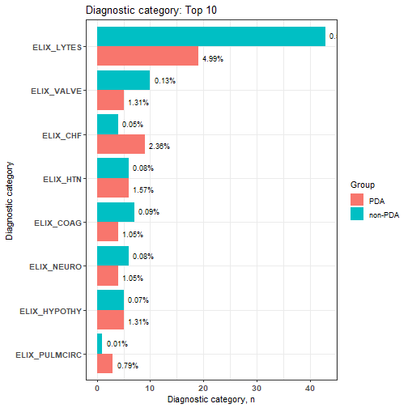
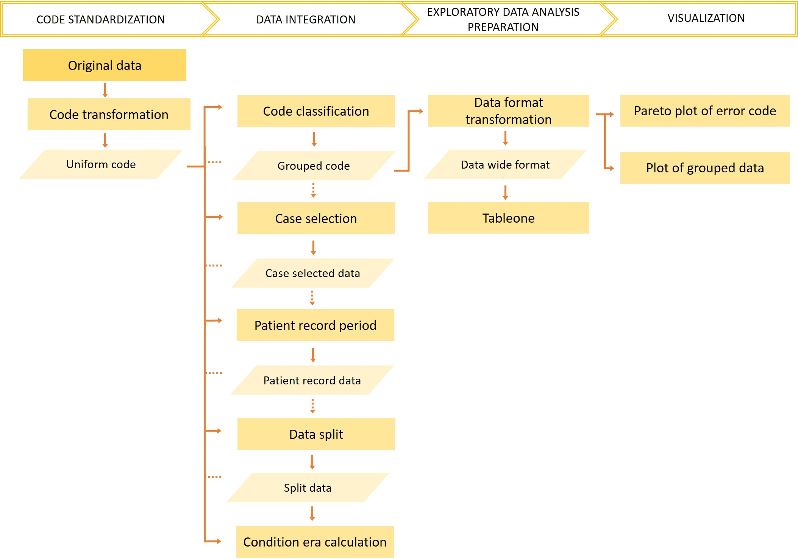
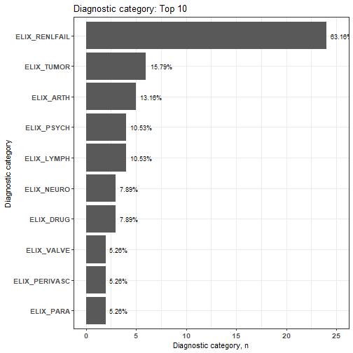

emr package Introduction
========================================================
author: Hsiang-Ju Chiu @ Chang Gung University
date: 2019/08/21
autosize: true
font-family: 'Microsoft JhengHei'
navigation: slide

Introduction
========================================================
- The open-source *emr* package aims to expedite an integrated analysis of electronic health records (EHRs). 

- The *emr* package provides mechanisms to analyze, integrate, and visualize clinical data, including diagnosis and procedure records.

- The *emr* package simplifies and accelerates the process of extracting ready-for-analysis datasets from EHR databases. 

Material
========================================================

- We provided a sample file `sampleFile_MIMIC` obtained from [MIMIC-III](https://www.nature.com/articles/sdata201635), a medical data set of 7,833 newborn patients with 45,674 admissions.
- This dataset used for verifying the comorbidity difference between the patients with **patent ductus arteriosus (PDA)** and the **non-PDA** patients by *emr* package.

```r
head(sample_MIMICIII,5)
```

| SUBJECT_ID| HADM_ID| ROW_ID| SEQ_NUM|ICD9_CODE |ADMITTIME  |ADMISSION_TYPE |DIAGNOSIS |
|----------:|-------:|------:|-------:|:---------|:----------|:--------------|:---------|
|          2|  163353|      1|       1|V3001     |2138-07-17 |NEWBORN        |NEWBORN   |
|          2|  163353|      2|       2|V053      |2138-07-17 |NEWBORN        |NEWBORN   |
|          2|  163353|      3|       3|V290      |2138-07-17 |NEWBORN        |NEWBORN   |
|          5|  178980|     22|       1|V3000     |2103-02-02 |NEWBORN        |NEWBORN   |
|          5|  178980|     23|       2|V053      |2103-02-02 |NEWBORN        |NEWBORN   |

Method
========================================================
- The mechanism of *emr* package:

    - Code standardization

    - Data Integration

    - Exploratory data analysis (EDA) preparation

    - Visualization

PDA case selection
========================================================
- We conducted **comorbidities analyses** based on a cohort of newborns from MIMIC-III by using *emr* package and tableone package.
- First, we separate the newborn (n = 7,833) into case (PDA) and control (non-PDA):
  - PDA: 381
  - non-PDA: 7452

PDA case selection
========================================================

```r
selectedPDA <- selectCases(sample_MIMICIII, SUBJECT_ID, ICD9_CODE, ADMITTIME, "9999/01/01", ICD, caseCondition = "^7470", caseCount = 1, CaseName = "PDA")
selectedPDA[379:383]
```

|    ID|selectedCase | count|firstCaseDate |endCaseDate |period |MostCommonICD | MostCommonICDCount|
|-----:|:------------|-----:|:-------------|:-----------|:------|:-------------|------------------:|
| 32433|PDA          |     1|2201-01-11    |2201-01-11  |0 days |7470          |                  1|
| 32603|PDA          |     1|2171-10-14    |2171-10-14  |0 days |7470          |                  1|
| 32803|PDA          |     1|2118-02-06    |2118-02-06  |0 days |7470          |                  1|
|     2|non-PDA      |    NA|NA            |NA          |NA     |NA            |                 NA|
|     5|non-PDA      |    NA|NA            |NA          |NA     |NA            |                 NA|

EDA preparation
========================================================
- Group diagnostic codes with Elixhauser comorbidity by *emr* package.
- Convert the long format of grouped data into a **wide** format.


```r
elix <- groupedDataLongToWide(sample_MIMICIII, SUBJECT_ID, ICD9_CODE,ADMITTIME, "9999-10-01", groupDataType = Elix, isDescription = F, selectedCaseFile = selectedPDA)
elix[17:21,c(1,14:19)]
```

|   | ID|ELIX_PULMCIRC |ELIX_RENLFAIL |ELIX_TUMOR |ELIX_VALVE |ELIX_WGHTLOSS |selectedCase |
|:--|--:|:-------------|:-------------|:----------|:----------|:-------------|:------------|
|17 | 70|FALSE         |FALSE         |FALSE      |FALSE      |FALSE         |non-PDA      |
|18 | 72|FALSE         |FALSE         |FALSE      |TRUE       |FALSE         |PDA          |
|19 | 74|FALSE         |FALSE         |FALSE      |FALSE      |FALSE         |non-PDA      |
|20 | 82|FALSE         |FALSE         |FALSE      |FALSE      |FALSE         |non-PDA      |
|21 | 87|FALSE         |FALSE         |FALSE      |FALSE      |FALSE         |non-PDA      |

Result by emr: histogram plot for comorbidity
========================================================

```r
plot_Elixhauser <- plot_groupedData(elix)
plot_Elixhauser$graph
```




Result by emr: significant comorbidity category
========================================================

```r
plot_Elixhauser$sigCate
```

|DiagnosticCategory |Group   |  N|Percentage |
|:------------------|:-------|--:|:----------|
|ELIX_LYTES         |non-PDA | 43|0.58%      |
|ELIX_LYTES         |PDA     | 19|4.99%      |
|ELIX_VALVE         |non-PDA | 10|0.13%      |
|ELIX_VALVE         |PDA     |  5|1.31%      |
|ELIX_CHF           |non-PDA |  4|0.05%      |
|ELIX_CHF           |PDA     |  9|2.36%      |
|ELIX_HTN           |non-PDA |  6|0.08%      |
|ELIX_HTN           |PDA     |  6|1.57%      |
|ELIX_COAG          |non-PDA |  7|0.09%      |
|ELIX_COAG          |PDA     |  4|1.05%      |
|ELIX_NEURO         |non-PDA |  6|0.08%      |
|ELIX_NEURO         |PDA     |  4|1.05%      |
|ELIX_HYPOTHY       |non-PDA |  5|0.07%      |
|ELIX_HYPOTHY       |PDA     |  5|1.31%      |
|ELIX_PULMCIRC      |non-PDA |  1|0.01%      |
|ELIX_PULMCIRC      |PDA     |  3|0.79%      |

Result by tableone 
========================================================

```r
var_col <- names(elix)[2:(length(elix)-1)]
table_Elix <- CreateTableOne(vars = var_col,strata = "selectedCase", data = as.data.frame(elix), factorVars = var_col)
table_Elix[c(1,3,4,8,10:12,14,17),]
```

|                           |"non-PDA" |"PDA"    |"p"    |"test" |
|:--------------------------|:---------|:--------|:------|:------|
|"n"                        |7452      |381      |       |       |
|"ELIX_CHF = TRUE (%)"      |4 (0.1)   |9 (2.4)  |<0.001 |       |
|"ELIX_COAG = TRUE (%)"     |7 (0.1)   |4 (1.0)  |<0.001 |       |
|"ELIX_HTN = TRUE (%)"      |6 (0.1)   |6 (1.6)  |<0.001 |       |
|"ELIX_HYPOTHY = TRUE (%)"  |5 (0.1)   |5 (1.3)  |<0.001 |       |
|"ELIX_LYTES = TRUE (%)"    |43 (0.6)  |19 (5.0) |<0.001 |       |
|"ELIX_NEURO = TRUE (%)"    |6 (0.1)   |4 (1.0)  |<0.001 |       |
|"ELIX_PULMCIRC = TRUE (%)" |1 (0.0)   |3 (0.8)  |<0.001 |       |
|"ELIX_VALVE = TRUE (%)"    |10 (0.1)  |5 (1.3)  |<0.001 |       |

Runtime for result
========================================================
 - Data: 7,833 newborn patients with 45,674 admissions.
    - Code standardization: 1.1 secs
    - Data integration (including code standardization) 
        - code classification: 1.2 secs
        - case selection: 1.5 secs
    - EDA preparation: 1.8 secs
    - Visualization: 0.2 secs


Overview
========================================================



Data: sample file
========================================================
- This sample file is used for illustrating the main functions of *emr* package.
- The data is a simulated medical data set of 38 patients with 300 records.

```r
sampleDxFile[6:10]
```

|ID  |ICD   |Date       |
|:---|:-----|:----------|
|A15 |Z992  |2023-05-12 |
|A0  |5855  |2013-12-20 |
|A0  |V4511 |2012-04-05 |
|A0  |V560  |2010-03-28 |
|A0  |5853  |2010-10-29 |

Method
========================================================
- The mechanism of *emr* package:

    - Code standardization

    - Data Integration

    - Exploratory data analysis (EDA) preparation

    - Visualization

ICD format
========================================================
- *emr* R package first standardized the ICD (International Classification of Diseases) codes into a **uniform format** before code classification.

| ICD code  |         ICD-9          |        ICD-10          |
|----------:|-----------------------:|:-----------------------|
|**Diagnostic** |short and decimal format|short and decimal format|
|Procedure  |short and decimal format|     only decimal format|

ICD format in grouping methods
========================================================
- Since the formats of ICD code used in the grouping tables could be different.
- The transformational type is according to the grouping method chosen by users.  

|                 ICD code                |  ICD format  |Code standardization|
|----------------------------------------:|-------------:|-------------------:|
|  Clinical Classifications Software (CCS)|short  format | IcdDxDecimalToShort|
|Phenome Wide Association Studies (PheWAS)|decimal format| IcdDxShortToDecimal|
|                              Comorbidity|short format  | IcdDxDecimalToShort|


Code standardization
========================================================
- We transform the diagnosis codes into uniform format before the integration process.
- Standardize the correctness of ICD codes:  
    - **Uniform format** 
    - **Display clear warning messages**  
    
    Help researchers to identify the potential coding error that may affect clinical data analysis.


Code standardization: short or decimal format
========================================================
- Uniform code format functions:
    - Decimal format: `IcdDxShortToDecimal`
    - Short format: `IcdDxDecimalToShort`
    
Code standardization: short or decimal format
========================================================    

```r
decimal <- IcdDxShortToDecimal(sampleDxFile, ICD, Date, "2015/10/01")
short <- IcdDxDecimalToShort(sampleDxFile, ICD, Date, "2015/10/01")
cbind(decimal = decimal$ICD[6:10], short = short$ICD[6:10])
```

|decimal.ICD |short.ICD |
|:-----------|:---------|
|Z99.2       |Z992      |
|585.5       |5855      |
|V45.11      |V4511     |
|V56.0       |V560      |
|585.3       |5853      |

Code standardization: warning message
========================================================
- Warning message: help users identify the potential coding error.
- There are two types of warning message:
    -	wrong ICD code format
    - wrong ICD code version
- The **suggestoin** helps user adjust the incorrect ICD-9 code with **unspecified** classification (Now only ICD-9 codes has suggestion).    

Code standardization: warning message
========================================================

```r
decimal$Error
```


|ICD    | count|IcdVersionInFile |WrongType     |Suggestion |
|:------|-----:|:----------------|:-------------|:----------|
|A0.11  |    20|ICD 10           |Wrong format  |           |
|V27.0  |    18|ICD 10           |Wrong version |           |
|E114   |     8|ICD 10           |Wrong format  |           |
|A01.05 |     8|ICD 9            |Wrong version |           |
|42761  |     7|ICD 10           |Wrong version |           |
|Z9.90  |     6|ICD 10           |Wrong format  |           |
|F42    |     6|ICD 10           |Wrong format  |           |
|V24.1  |     6|ICD 10           |Wrong version |           |
|A0105  |     5|ICD 9            |Wrong version |           |
|001    |     5|ICD 9            |Wrong format  |0019       |
|75.52  |     4|ICD 9            |Wrong format  |           |
|E03.0  |     4|ICD 9            |Wrong version |           |
|650    |     4|ICD 10           |Wrong version |           |
|123.45 |     3|ICD 10           |Wrong format  |           |
|755.2  |     3|ICD 9            |Wrong format  |755.29     |
|7552   |     2|ICD 9            |Wrong format  |75529      |

Data Integration
========================================================
- We provide four strategies to **group** EHR diagnostic code.

- After code grouping, this package provides functions for **querying matching cases**, **splitting data** and **calculating condition era** by grouped categories of each patients. 

Data Integration
========================================================
Integrated EHR data: 
 1. Code classification
 2. Case selection
 3. Patient record period
 4. Data split
 5. Condition era calculation

Data Integration: code classification
========================================================
- Four strategies to group EHR diagnosis codes:
   - **CCS**
          - `IcdDxToCCS()`
          - `IcdDxToCCSLvl()`
   - **PheWAS**: `IcdDxToPheWAS()`
   - **Comorbidity** (Elixhauser, AHRQ, and Charlson): `IcdDxToComorbid()` 
    - **Customized defined grouping methods**:
          - `IcdDxToCustom()`
          - `IcdDxToCustomGrep()`
 
Data Integration: code classification
========================================================
- Standardization grouping long data by CCS multiple level 2.

```r
CCSlvl <- IcdDxToCCSLvl(sampleDxFile, ID, ICD, Date, "2015-10-01", 2)
head(CCSlvl$groupedDT, 3)
```

|Short |ID |ICD  |Date       |CCS_LVL_2_LABEL                |
|:-----|:--|:----|:----------|:------------------------------|
|Z992  |A2 |Z992 |2020-05-22 |Diseases of the urinary system |
|Z992  |A5 |Z992 |2020-01-24 |Diseases of the urinary system |
|Z992  |A8 |Z992 |2015-10-27 |Diseases of the urinary system |

Data Integration: code classification
========================================================
- Standardization grouping **summarised** long data by CCS multiple level 2.

```r
head(CCSlvl$summarised_groupedDT, 3)
```

|ID  |CCS_LVL_2_LABEL                |firstCaseDate |endCaseDate | count|period    |
|:---|:------------------------------|:-------------|:-----------|-----:|:---------|
|A0  |Diseases of the urinary system |2009-07-25    |2013-12-20  |     5|1609 days |
|A1  |Diseases of the urinary system |2006-11-29    |2014-09-24  |     5|2856 days |
|A10 |Diseases of the urinary system |2007-11-04    |2012-07-30  |     5|1730 days |


Data Integration: case selection
========================================================
- Query the matching defined conditions cases.

```r
case <- selectCases(sampleDxFile, ID, ICD, Date, "2015/10/01", ccslvl2, caseCondition = "Diseases of the urinary system", caseCount = 1, CaseName = "Selected")
case[20:25]
```

|ID |selectedCase | count|firstCaseDate |endCaseDate |period    |MostCommonICD | MostCommonICDCount|
|:--|:------------|-----:|:-------------|:-----------|:---------|:-------------|------------------:|
|A5 |Selected     |     5|2009-09-10    |2020-01-24  |3788 days |V420          |                  1|
|A6 |Selected     |     5|2007-10-01    |2015-07-12  |2841 days |5854          |                  1|
|A7 |Selected     |     5|2007-02-01    |2014-08-14  |2751 days |5854          |                  1|
|A8 |Selected     |     5|2007-11-22    |2015-10-27  |2896 days |V561          |                  1|
|B2 |Selected     |     6|2016-03-20    |2024-09-20  |3106 days |N189          |                  1|
|C0 |non-Selected |    NA|NA            |NA          |NA        |NA            |                 NA|

Data Integration: patient record period
========================================================
- Find the first/last admission date for each patient.

```r
admissionDate <- patientRecordDate(sampleDxFile, ID, ICD, Date)
admissionDate[grep("0$",ID),]
```

|ID  |firstRecordDate |endRecordDate |
|:---|:---------------|:-------------|
|A10 |2007-11-04      |2023-03-11    |
|A0  |2009-07-25      |2023-08-12    |
|C0  |2015-12-05      |2025-02-21    |
|B0  |2015-12-26      |2024-02-12    |
|D0  |2017-01-29      |2025-04-08    |

Index date
========================================================
- These records can be used for a given patient as an index date for **data split** function.

```r
indexDateTable <- data.frame(ID = c("A0","B0","C0","D0"), indexDate = c("2023-08-12", "2024-02-12","2015-12-05", "2017-01-29"), stringsAsFactors = FALSE)
indexDateTable
```

|ID |indexDate  |
|:--|:----------|
|A0 |2023-08-12 |
|B0 |2024-02-12 |
|C0 |2015-12-05 |
|D0 |2017-01-29 |

Data Integration: data split
========================================================
- Split data by the date of clinical event.
    - Show the data is recorded **before** or **after** the clinical event.
    - Count the number of windows between the record date and index date.
    
Data Integration: data split
========================================================    

```r
certainPatient <- sampleDxFile[grepl("A0|B0|C0|D0",ID),]
splitedData <- splitDataByDate(certainPatient, ID, ICD, Date, indexDateTable) 
splitedData[15:19,]
```

|ID |ICD  |Date       |indexDate  |timeTag | window|
|:--|:----|:----------|:----------|:-------|------:|
|B0 |N183 |2023-08-28 |2024-02-12 |B       |      6|
|B0 |N19  |2023-11-18 |2024-02-12 |B       |      3|
|B0 |N19  |2024-02-12 |2024-02-12 |A       |      1|
|C0 |C671 |2015-12-05 |2015-12-05 |A       |      1|
|C0 |C048 |2016-07-05 |2015-12-05 |A       |      8|

Data Integration: condition era
========================================================
- Used to integrate distributed data of clinical records into a single progression record

```r
era <- getConditionEra(sampleDxFile, ID, ICD, Date, "2015-10-01", ccs, FALSE)
head(Era)  
```

|ID  |CCS_CATEGORY_DESCRIPTION |firstCaseDate |endCaseDate | count| era|period    |
|:---|:------------------------|:-------------|:-----------|-----:|---:|:---------|
|A0  |Chronic kidney disease   |2009-07-25    |2013-12-20  |     5|   5|1609 days |
|A1  |Chronic kidney disease   |2006-11-29    |2014-09-24  |     5|   5|2856 days |
|A10 |Chronic kidney disease   |2007-11-04    |2012-07-30  |     5|   4|1730 days |
|A11 |Chronic kidney disease   |2008-03-09    |2011-09-03  |     5|   4|1273 days |
|A12 |Chronic kidney disease   |2006-05-14    |2015-06-29  |     5|   5|3333 days |
|A13 |Chronic kidney disease   |2006-04-29    |2025-02-02  |     5|   5|6854 days |

EDA preparation
========================================================
- Convert the long format of grouped data into a wide format which is fit to others analytical and plotting packages.

- There are two wide format to select: numeric and binary.

EDA preparation
========================================================


```r
wideData <- groupedDataLongToWide(sampleDxFile, ID, ICD, Date, "2015-10-01", elix, isDescription = F)
head(wideData[,-(2:14))]
```

|ID  |ELIX_RENLFAIL |ELIX_TUMOR |ELIX_ULCER |ELIX_VALVE |ELIX_WGHTLOSS |
|:---|:-------------|:----------|:----------|:----------|:-------------|
|A0  |TRUE          |FALSE      |FALSE      |FALSE      |FALSE         |
|A1  |TRUE          |FALSE      |FALSE      |FALSE      |FALSE         |
|A10 |TRUE          |FALSE      |FALSE      |FALSE      |FALSE         |
|A11 |TRUE          |FALSE      |FALSE      |FALSE      |FALSE         |
|A12 |TRUE          |FALSE      |FALSE      |FALSE      |FALSE         |
|A13 |TRUE          |FALSE      |FALSE      |FALSE      |FALSE         |

Visualization
========================================================
- The emr package provides two functions to observe the overview of grouped clinical data.
   - **Pareto chart** for error ICD list
   - **Histogram plot** for grouped data
 
Pareto plot for error ICD codes 
========================================================
- Plot for error ICD list
    - Through first phase function, code standardization, which generates a data of diagnosis codes with potential error.

```r
plotErrorICD <- plot_errorICD(decimal$Error)
plotErrorICD$graph
```


Pareto plot for error ICD codes 
========================================================
- Top 10 error ICD codes

```r
plotErrorICD$ICD
```

|ICD    | count|CumCountPerc |IcdVersionInFile |WrongType     |Suggestion |
|:------|-----:|:------------|:----------------|:-------------|:----------|
|A0.11  |    20|18.35%       |ICD 10           |Wrong format  |           |
|V27.0  |    18|34.86%       |ICD 10           |Wrong version |           |
|E114   |     8|42.2%        |ICD 10           |Wrong format  |           |
|A01.05 |     8|49.54%       |ICD 9            |Wrong version |           |
|42761  |     7|55.96%       |ICD 10           |Wrong version |           |
|Z9.90  |     6|61.47%       |ICD 10           |Wrong format  |           |
|F42    |     6|66.97%       |ICD 10           |Wrong format  |           |
|V24.1  |     6|72.48%       |ICD 10           |Wrong version |           |
|A0105  |     5|77.06%       |ICD 9            |Wrong version |           |
|001    |     5|81.65%       |ICD 9            |Wrong format  |0019       |
|Others |    20|100%         |ICD 9            |Wrong format  |           |

Histogram plot for grouped data
========================================================
- Plot of diagnostic categories
    - An overview of grouping category of the diagnostic code summarizes the percentage of result in histogram plot.

```r
plotGroupedData <- plot_groupedData(wideData)
plotGroupedData$graph
```



Histogram plot for grouped data
========================================================
- Top 10 diagnostic codes grouped by Elixhauser comorbidity

```r
plotGroupedData$sigCate
```

|DiagnosticCategory |  N|Percentage |
|:------------------|--:|:----------|
|ELIX_RENLFAIL      | 24|63.16%     |
|ELIX_TUMOR         |  6|15.79%     |
|ELIX_ARTH          |  5|13.16%     |
|ELIX_LYMPH         |  4|10.53%     |
|ELIX_PSYCH         |  4|10.53%     |
|ELIX_DRUG          |  3|7.89%      |
|ELIX_NEURO         |  3|7.89%      |
|ELIX_PARA          |  2|5.26%      |
|ELIX_PERIVASC      |  2|5.26%      |
|ELIX_VALVE         |  2|5.26%      |

Performance
========================================================
- Dataset: 953,294 unique patients and 7,948,418 admission records.
  - Code standardization took 6.2 seconds
  - Data integration (including code standardization):
      - code classification with Charlson comorbidity took 8.5 seconds.
      - case selection took 14.3 seconds 
  - EDA preparation took 16.5 seconds. 
  - Visualizatoin: histogram plot took 1.0 seconds.


Procedure: code standardzation
========================================================
- ICD procedure code format

| ICD code  |         ICD-9          |        ICD-10          |
|----------:|-----------------------:|:-----------------------|
|Diagnostic |short and decimal format|short and decimal format|
|**Procedure**|short and decimal format| only decimal format|

- ICD format in grouping methods

| ICD code       |  ICD format  |Code standardization|
|:---------------|:-------------|-------------------:|
|CCS             |short format  | IcdDxDecimalToShort|
|procedure class |short format  | IcdDxDecimalToShort|

Procedure: sample file
========================================================
- There is also a sample file for procedure record, which has 3 patients and 170 records.


```r
samplePrFile[84:88]
```

|ID |ICD     |Date       |
|:--|:-------|:----------|
|C  |0944    |2008-10-26 |
|A  |19.6    |2007-10-24 |
|C  |021R0ZA |2020-04-09 |
|C  |008K3ZZ |2020-02-27 |
|C  |0213093 |2017-12-26 |

Procedure: code standardization
========================================================
- Uniform code format functions:
    - Decimal format: `IcdPrShortToDecimal`
    - Short format: `IcdPrDecimalToShort`
- Procedure code standardization also has warning message helping users to identify the potential coding error.

Procedure: code classification
========================================================
- The functions of related procedure record provide two strategies:  
    - CCS
        - The CCS classification also has single and multiple levels
        - The usage is similar to the diagnostic CCS classification.
    - Procedure class  
   
    Collapse ICD procedure codes into clinically meaningful categories for further analysis. 

Procedure: code classification
========================================================


```r
ProcedureClass <- IcdPrToProcedureClass(samplePrFile, ID, ICD, Date, "2015-10-01")
head(ProcedureClass$groupedDT)
```

|Short |ID |ICD   |Date       |PROCEDURE_CLASS_NAME |
|:-----|:--|:-----|:----------|:--------------------|
|5681  |B  |5681  |2008-01-14 |Major Therapeutic    |
|9774  |A  |9774  |2009-01-11 |Minor Therapeutic    |
|4499  |B  |44.99 |2009-05-10 |Major Therapeutic    |
|0759  |C  |07.59 |2009-01-21 |Major Therapeutic    |
|0205  |B  |0205  |2008-07-06 |Major Therapeutic    |
|8812  |B  |8812  |2007-06-27 |Minor Diagnostic     |

More Detail
========================================================
- Geting start
    - Diagnostic part
        - English: https://dhlab-cgu.github.io/emr/articles/Eng_Diagnosis.html
        - Chinese: https://dhlab-cgu.github.io/emr/articles/Chi_Diagnosis.html
    - Procedure part
        - English: https://dhlab-cgu.github.io/emr/articles/Eng_Procedure.html
        - Chinese: https://dhlab-cgu.github.io/emr/articles/Chi_Procedure.html

