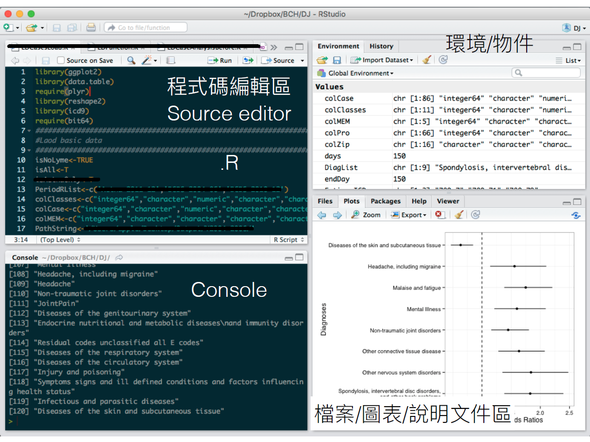
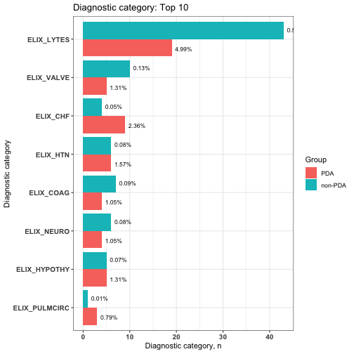
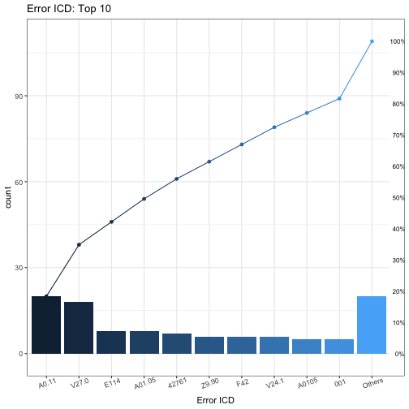
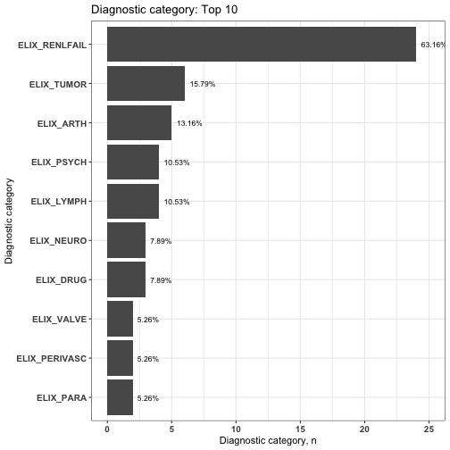

Diagnosis and procedure data analysis - emr package in R
========================================================
author: Hsiang-Ju Chiu and Yi-Ju Tseng @ Chang Gung University
date: 2019/08/23
autosize: true
font-family: 'Microsoft JhengHei'
navigation: slide

Introduction - emr package
========================================================
- Provide mechanisms to **integrate**, **analyze**, and **visualize** diagnosis and procedure records
- Simplifie and accelerate the process of extracting **ready-for-analysis** datasets from EHRs 

Introduction - emr package
========================================================
- An R package 
- Open-source software on [GitHub](https://github.com/DHLab-CGU/emr)


You need to install R and RStudio for the first time
========================================================
type:section


R vs. RStudio
========================================================

[R](https://cloud.r-project.org/) : Core (engine)

[Source](https://www.teslarati.com/tesla-patent-more-efficient-electric-motors/)

R vs. RStudio
========================================================

[RStudio](https://www.rstudio.com/products/rstudio/download/#download) : IDE (dashboard)

[Source](https://www.theverge.com/2015/3/19/8260295/tesla-user-interface-redesign-concept)


You need to know how to use R and RStudio for the first time
========================================================
type:section

RStudio Interface
========================================================
left: 40%
4 Blocks in RStudio：

- Source editor  -> edit the codes here
- Console -> get the results here
- environment/...
- File/Figure/...

***



R and R Packages
========================================================

R : Core (iPhone)


R and R Packages
========================================================

R Packages : APP


[Source](https://www.apple.com/)


R = Base + Other Packages
========================================================
- How to install packages?

```r
install.packages("Package name")
```

- How to load the installed packages?

```r
library(Package name)
```


Functions - Basic
========================================================
- Basic functions
- Functions provided by packages (such as *emr*)
- `function_name(argument1, argument2,....)`

For example, we can get the average of numbers by `mean()` function:

```r
mean(c(1,2,3,4,5,6)) ##average of 1~6
```

```
[1] 3.5
```

Functions - Arguments
========================================================

If you don't know the defined order, you can assign the arguments by name


```r
seq(from=1,to=9,by=2)
```

```
[1] 1 3 5 7 9
```


Back to emr package
========================================================
type:section

How to install emr package?
========================================================
- Not on CRAN right now
- Install from GitHub (by *devtools* package)

```r
install.packages("devtools")
devtools::install_github("DHLab-CGU/emr")
library(emr)
```


Other packages used in the tutorial
========================================================

```r
install.packages("tidyverse")
install.packages("tableone")
library(tidyverse)
library(tableone)
```


PDA vs. non-PDA in MIMIC-III - a Use case
========================================================
type:section


Final goals of this tutorial
========================================================
Explore the comorbidity or underlying diseases difference between **patent ductus arteriosus (PDA)** and the **non-PDA** patients


Demo data
========================================================
- Sample file `sampleFile_MIMIC`
- [MIMIC-III](https://www.nature.com/articles/sdata201635), a dataset of 7,833 newborn patients with 45,674 admissions

```r
head(sample_MIMICIII)
```

| SUBJECT_ID| HADM_ID| ROW_ID| SEQ_NUM|ICD9_CODE |ADMITTIME  |ADMISSION_TYPE |DIAGNOSIS |
|----------:|-------:|------:|-------:|:---------|:----------|:--------------|:---------|
|          2|  163353|      1|       1|V3001     |2138-07-17 |NEWBORN        |NEWBORN   |
|          2|  163353|      2|       2|V053      |2138-07-17 |NEWBORN        |NEWBORN   |
|          2|  163353|      3|       3|V290      |2138-07-17 |NEWBORN        |NEWBORN   |
|          5|  178980|     22|       1|V3000     |2103-02-02 |NEWBORN        |NEWBORN   |
|          5|  178980|     23|       2|V053      |2103-02-02 |NEWBORN        |NEWBORN   |
|          5|  178980|     24|       3|V290      |2103-02-02 |NEWBORN        |NEWBORN   |

Steps to accomplish the goals
========================================================
1. Select PDA case
2. Group diagnosis records
3. Visualize the diagnosis records
4. Generate "Table 1" for the analysis


1. PDA case selection
========================================================
- Split the newborns (n = 7,833) into case (PDA) and control (non-PDA) groups:
  - PDA: 381
  - non-PDA: 7452

1. PDA case selection
========================================================

```r
selectedPDA <- 
  selectCases(sample_MIMICIII, 
              SUBJECT_ID, ICD9_CODE, 
              ADMITTIME, "2015/10/01", 
              ICD, caseCondition = "^7470", 
              caseCount = 1, 
              CaseName = "PDA")
```

```r
selectedPDA
```

|    ID|selectedCase | count|firstCaseDate |endCaseDate |period |MostCommonICD | MostCommonICDCount|
|-----:|:------------|-----:|:-------------|:-----------|:------|:-------------|------------------:|
| 32433|PDA          |     1|2201-01-11    |2201-01-11  |0 days |7470          |                  1|
| 32603|PDA          |     1|2171-10-14    |2171-10-14  |0 days |7470          |                  1|
| 32803|PDA          |     1|2118-02-06    |2118-02-06  |0 days |7470          |                  1|
|     2|non-PDA      |    NA|NA            |NA          |NA     |NA            |                 NA|
|     5|non-PDA      |    NA|NA            |NA          |NA     |NA            |                 NA|

1. PDA case selection - arguments
========================================================
- DxDataFile: sample_MIMICIII
- idColName: SUBJECT_ID
- icdColName: ICD9_CODE
- dateColName: ADMITTIME

```r
selectedPDA <- 
  selectCases(sample_MIMICIII, 
              SUBJECT_ID, ICD9_CODE, 
              ADMITTIME, "2015/10/01", 
              ICD, caseCondition = "^7470", 
              caseCount = 1, 
              CaseName = "PDA")
```

1. PDA case selection - arguments
========================================================
- icd10usingDate: 2015/10/01
- groupDataType: ICD (CCS, AHRQ, PheWAS...)
- caseCount: 1
- CaseName = "PDA"

```r
selectedPDA <- 
  selectCases(sample_MIMICIII, 
              SUBJECT_ID, ICD9_CODE, 
              ADMITTIME, "2015/10/01", 
              ICD, caseCondition = "^7470", 
              caseCount = 1, 
              CaseName = "PDA")
```

1. PDA case selection - check original data
========================================================

```r
selectedPDA
```

|    ID|selectedCase | count|firstCaseDate |endCaseDate |period |MostCommonICD | MostCommonICDCount|
|-----:|:------------|-----:|:-------------|:-----------|:------|:-------------|------------------:|
| 32433|PDA          |     1|2201-01-11    |2201-01-11  |0 days |7470          |                  1|

```r
sample_MIMICIII[SUBJECT_ID=="32433"&
                        grepl("^747",ICD9_CODE)]
```

| SUBJECT_ID|ICD9_CODE |ADMITTIME  |
|----------:|:---------|:----------|
|      32433|7470      |2201-01-11 |

Demo data
========================================================

```r
sample_MIMICIII[1:6,
                c("SUBJECT_ID", 
                  "ICD9_CODE", "ADMITTIME")]
```

| SUBJECT_ID|ICD9_CODE |ADMITTIME  |
|----------:|:---------|:----------|
|          2|V3001     |2138-07-17 |
|          2|V053      |2138-07-17 |
|          2|V290      |2138-07-17 |
|          5|V3000     |2103-02-02 |
|          5|V053      |2103-02-02 |
|          5|V290      |2103-02-02 |

2. Group diagnosis records
========================================================
- Group diagnostic codes with Elixhauser comorbidity
- Convert the long format of data into a **wide** format
- Arguments:
  - groupDataType: Elix (AHRQ, CCS)
  - isDescription: F (T)
  - selectedCaseFile: selectedPDA (From case select step)

```r
elix <- 
  groupedDataLongToWide(
    sample_MIMICIII,SUBJECT_ID,
    ICD9_CODE,ADMITTIME, 
    "9999-10-01", groupDataType = Elix, 
    isDescription = F, 
    selectedCaseFile = selectedPDA)
```

2. Group diagnosis records
========================================================

```r
elix
```

|   | ID|ELIX_RENLFAIL |ELIX_TUMOR |ELIX_VALVE |ELIX_WGHTLOSS |selectedCase |
|:--|--:|:-------------|:----------|:----------|:-------------|:------------|
|17 | 70|FALSE         |FALSE      |FALSE      |FALSE         |non-PDA      |
|18 | 72|FALSE         |FALSE      |TRUE       |FALSE         |PDA          |
|19 | 74|FALSE         |FALSE      |FALSE      |FALSE         |non-PDA      |
|20 | 82|FALSE         |FALSE      |FALSE      |FALSE         |non-PDA      |
|21 | 87|FALSE         |FALSE      |FALSE      |FALSE         |non-PDA      |

3. Visualize the diagnosis records: histogram for comorbidity
========================================================

```r
plot_Elixhauser <- plot_groupedData(elix)
plot_Elixhauser$graph
```




3. Visualize the diagnosis records: significantly different comorbidities
========================================================

```r
plot_Elixhauser$sigCate
```

|DiagnosticCategory |Group   |  N|Percentage |
|:------------------|:-------|--:|:----------|
|ELIX_LYTES         |non-PDA | 43|0.58%      |
|ELIX_LYTES         |PDA     | 19|4.99%      |
|ELIX_VALVE         |non-PDA | 10|0.13%      |
|ELIX_VALVE         |PDA     |  5|1.31%      |
|ELIX_CHF           |non-PDA |  4|0.05%      |
|ELIX_CHF           |PDA     |  9|2.36%      |
|ELIX_HTN           |non-PDA |  6|0.08%      |
|ELIX_HTN           |PDA     |  6|1.57%      |
|ELIX_COAG          |non-PDA |  7|0.09%      |
|ELIX_COAG          |PDA     |  4|1.05%      |
|ELIX_NEURO         |non-PDA |  6|0.08%      |
|ELIX_NEURO         |PDA     |  4|1.05%      |
|ELIX_HYPOTHY       |non-PDA |  5|0.07%      |
|ELIX_HYPOTHY       |PDA     |  5|1.31%      |
|ELIX_PULMCIRC      |non-PDA |  1|0.01%      |
|ELIX_PULMCIRC      |PDA     |  3|0.79%      |

4. Generate "Table 1" for the analysis
========================================================

```r
var_col <- 
  names(elix)[2:(length(elix)-1)]
table_Elix <- 
  CreateTableOne(vars = var_col,
                 strata = "selectedCase", 
                 data = as.data.frame(elix), 
                 factorVars = var_col)
table_Elix
```

|                           |"non-PDA" |"PDA"    |"p"    |"test" |
|:--------------------------|:---------|:--------|:------|:------|
|"n"                        |7452      |381      |       |       |
|"ELIX_CHF = TRUE (%)"      |4 (0.1)   |9 (2.4)  |<0.001 |       |
|"ELIX_COAG = TRUE (%)"     |7 (0.1)   |4 (1.0)  |<0.001 |       |
|"ELIX_HTN = TRUE (%)"      |6 (0.1)   |6 (1.6)  |<0.001 |       |
|"ELIX_HYPOTHY = TRUE (%)"  |5 (0.1)   |5 (1.3)  |<0.001 |       |
|"ELIX_LYTES = TRUE (%)"    |43 (0.6)  |19 (5.0) |<0.001 |       |
|"ELIX_NEURO = TRUE (%)"    |6 (0.1)   |4 (1.0)  |<0.001 |       |
|"ELIX_PULMCIRC = TRUE (%)" |1 (0.0)   |3 (0.8)  |<0.001 |       |
|"ELIX_VALVE = TRUE (%)"    |10 (0.1)  |5 (1.3)  |<0.001 |       |


Closer view of emr package
========================================================
type:section

Overview of emr package
========================================================
1. Code standardization
2. Data integration
3. Exploratory data analysis (EDA) preparation
4. Visualization

Overview of emr package
========================================================


Data: another sample data
========================================================
- For illustrating the main functions of *emr* package
- Simulated medical data set of 38 patients with 300 records

```r
sampleDxFile[6:10]
```

|ID  |ICD   |Date       |
|:---|:-----|:----------|
|A15 |Z992  |2023-05-12 |
|A0  |5855  |2013-12-20 |
|A0  |V4511 |2012-04-05 |
|A0  |V560  |2010-03-28 |
|A0  |5853  |2010-10-29 |


ICD formats
========================================================
- Standardize the ICD codes into a **uniform format** before analysis
  - short format: xxxyy
  - decimal format: xxx**.**yy

| ICD code  |         ICD-9          |        ICD-10          |
|----------:|-----------------------:|:-----------------------|
|**Diagnosis** |short and decimal format|short and decimal format|
|Procedure  |short and decimal format|     only decimal format|

Why we need to convert the ICD formats?
========================================================
- The formats of ICD used in the grouping tables could be different
- Already integrated into grouping method  

|                 ICD code                |  ICD format  |Code standardization|
|----------------------------------------:|-------------:|-------------------:|
|  Clinical Classifications Software (CCS)|short  format | IcdDxDecimalToShort|
|Phenome Wide Association Studies (PheWAS)|decimal format| IcdDxShortToDecimal|
|                              Comorbidity|short format  | IcdDxDecimalToShort|


1. Code standardization
========================================================
type:sub-section
- Transform the diagnosis codes into **uniform** format before analysis
- Check the correctness of ICD codes: with **clear warning messages** 
  - Help researchers identify the potential coding error that may affect analysis


1. Code standardization: short or decimal format
========================================================
- Uniform code format functions:
    - Decimal format: `IcdDxShortToDecimal`
    - Short format: `IcdDxDecimalToShort`
    
1. Code standardization: short or decimal format
========================================================    

```r
decimal <- 
  IcdDxShortToDecimal(sampleDxFile, ICD, 
                      Date, "2015/10/01")
short <- 
  IcdDxDecimalToShort(sampleDxFile, ICD, 
                      Date, "2015/10/01")
```

```r
cbind(decimal = decimal$ICD[6:10], 
      short = short$ICD[6:10])
```

|decimal.ICD |short.ICD |
|:-----------|:---------|
|Z99.2       |Z992      |
|585.5       |5855      |
|V45.11      |V4511     |
|V56.0       |V560      |
|585.3       |5853      |

1. Code standardization: warning message
========================================================
- Warning message: identify the potential coding error
- There are two types of warning message:
    -	wrong ICD code format
    - wrong ICD code version
- The **suggestoin** helps user adjust the incorrect ICD-9 code with **unspecified** classification (now only ICD-9 codes has suggestion).    

1. Code standardization: warning message
========================================================

```r
decimal$Error
```


|ICD    | count|IcdVersionInFile |WrongType     |Suggestion |
|:------|-----:|:----------------|:-------------|:----------|
|A0.11  |    20|ICD 10           |Wrong format  |           |
|V27.0  |    18|ICD 10           |Wrong version |           |
|E114   |     8|ICD 10           |Wrong format  |           |
|A01.05 |     8|ICD 9            |Wrong version |           |
|42761  |     7|ICD 10           |Wrong version |           |
|Z9.90  |     6|ICD 10           |Wrong format  |           |
|F42    |     6|ICD 10           |Wrong format  |           |
|V24.1  |     6|ICD 10           |Wrong version |           |
|A0105  |     5|ICD 9            |Wrong version |           |
|001    |     5|ICD 9            |Wrong format  |0019       |
|75.52  |     4|ICD 9            |Wrong format  |           |
|E03.0  |     4|ICD 9            |Wrong version |           |
|650    |     4|ICD 10           |Wrong version |           |
|123.45 |     3|ICD 10           |Wrong format  |           |
|755.2  |     3|ICD 9            |Wrong format  |755.29     |
|7552   |     2|ICD 9            |Wrong format  |75529      |

2. Data integration
========================================================
type:sub-section

- We provide four strategies to **group** EHR diagnostic code.

- After grouping, this package provides functions for **querying matching cases**, **splitting data** and **generating condition era**  

2. Data integration
========================================================

Integrated EHR data: 
 1. Code classification
 2. Case selection
 3. Patient record period
 4. Data split
 5. Condition era calculation

2. Data integration: code classification
========================================================
- Four strategies to group EHR diagnosis codes:
   - **CCS**
          - `IcdDxToCCS()`
          - `IcdDxToCCSLvl()`
   - **PheWAS**: `IcdDxToPheWAS()`
   - **Comorbidity** (Elixhauser, AHRQ, and Charlson): `IcdDxToComorbid()` 
    - **Customized grouping methods**:
          - `IcdDxToCustom()`
          - `IcdDxToCustomGrep()`
 
2. Code classification - CCS
======================================================== 


2. Code classification - PheWAS
======================================================== 


2. Code classification - Comorbidity
======================================================== 

 
2. Data integration: code classification
========================================================
- Grouped data by CCS multiple level 2

```r
CCSlvl <- 
  IcdDxToCCSLvl(sampleDxFile, 
                ID, ICD, Date, 
                "2015-10-01", 2)
```

```r
CCSlvl$groupedDT
```

|Short |ID  |ICD  |Date       |CCS_LVL_2_LABEL                |
|:-----|:---|:----|:----------|:------------------------------|
|Z992  |A2  |Z992 |2020-05-22 |Diseases of the urinary system |
|Z992  |A5  |Z992 |2020-01-24 |Diseases of the urinary system |
|Z992  |A8  |Z992 |2015-10-27 |Diseases of the urinary system |
|Z992  |A13 |Z992 |2020-04-26 |Diseases of the urinary system |
|Z992  |A13 |Z992 |2025-02-02 |Diseases of the urinary system |
|Z992  |A15 |Z992 |2023-05-12 |Diseases of the urinary system |

2. Data integration: code classification
========================================================
- **Summarised** grouped data by CCS multiple level 2

```r
CCSlvl$summarised_groupedDT
```

|ID  |CCS_LVL_2_LABEL                |firstCaseDate |endCaseDate | count|period    |
|:---|:------------------------------|:-------------|:-----------|-----:|:---------|
|A0  |Diseases of the urinary system |2009-07-25    |2013-12-20  |     5|1609 days |
|A1  |Diseases of the urinary system |2006-11-29    |2014-09-24  |     5|2856 days |
|A10 |Diseases of the urinary system |2007-11-04    |2012-07-30  |     5|1730 days |
|A11 |Diseases of the urinary system |2008-03-09    |2011-09-03  |     5|1273 days |
|A12 |Diseases of the urinary system |2006-05-14    |2015-06-29  |     5|3333 days |
|A13 |Diseases of the urinary system |2006-04-29    |2025-02-02  |     5|6854 days |

2. Data integration: code classification
========================================================
- Grouped data by CCS single level

```r
CCS <- 
  IcdDxToCCS(sampleDxFile, 
                ID, ICD, Date, 
                "2015-10-01")
```

```r
CCS$groupedDT
```

|Short |ID  |ICD  |Date       |CCS_CATEGORY_DESCRIPTION |
|:-----|:---|:----|:----------|:------------------------|
|Z992  |A2  |Z992 |2020-05-22 |Chronic kidney disease   |
|Z992  |A5  |Z992 |2020-01-24 |Chronic kidney disease   |
|Z992  |A8  |Z992 |2015-10-27 |Chronic kidney disease   |
|Z992  |A13 |Z992 |2020-04-26 |Chronic kidney disease   |
|Z992  |A13 |Z992 |2025-02-02 |Chronic kidney disease   |
|Z992  |A15 |Z992 |2023-05-12 |Chronic kidney disease   |

2. Data integration: code classification
========================================================
- **Summarised** grouped data by CCS single level

```r
CCS$summarised_groupedDT
```

|ID  |CCS_CATEGORY_DESCRIPTION |firstCaseDate |endCaseDate | count|period    |
|:---|:------------------------|:-------------|:-----------|-----:|:---------|
|A0  |Chronic kidney disease   |2009-07-25    |2013-12-20  |     5|1609 days |
|A1  |Chronic kidney disease   |2006-11-29    |2014-09-24  |     5|2856 days |
|A10 |Chronic kidney disease   |2007-11-04    |2012-07-30  |     5|1730 days |
|A11 |Chronic kidney disease   |2008-03-09    |2011-09-03  |     5|1273 days |
|A12 |Chronic kidney disease   |2006-05-14    |2015-06-29  |     5|3333 days |
|A13 |Chronic kidney disease   |2006-04-29    |2025-02-02  |     5|6854 days |

2. Data integration: case selection
========================================================
- Query the matched cases
- groupDataType: ccslvl2

```r
case <- 
  selectCases(sampleDxFile, ID, ICD, Date, 
              "2015/10/01", ccslvl2, 
              caseCondition = "Diseases of the urinary system", 
              caseCount = 1, 
              CaseName = "Selected")
```

```r
case[20:25]
```

|ID |selectedCase | count|firstCaseDate |endCaseDate |period    |MostCommonICD | MostCommonICDCount|
|:--|:------------|-----:|:-------------|:-----------|:---------|:-------------|------------------:|
|A5 |Selected     |     5|2009-09-10    |2020-01-24  |3788 days |V420          |                  1|
|A6 |Selected     |     5|2007-10-01    |2015-07-12  |2841 days |5854          |                  1|
|A7 |Selected     |     5|2007-02-01    |2014-08-14  |2751 days |5854          |                  1|
|A8 |Selected     |     5|2007-11-22    |2015-10-27  |2896 days |V561          |                  1|
|B2 |Selected     |     6|2016-03-20    |2024-09-20  |3106 days |N189          |                  1|
|C0 |non-Selected |    NA|NA            |NA          |NA        |NA            |                 NA|

2. Data integration: patient record period
========================================================
- Get the first/last record date for each patient

```r
recordDate <- 
  patientRecordDate(sampleDxFile, ID, ICD, Date)
```

```r
recordDate
```

|ID  |firstRecordDate |endRecordDate |
|:---|:---------------|:-------------|
|A10 |2007-11-04      |2023-03-11    |
|A0  |2009-07-25      |2023-08-12    |
|C0  |2015-12-05      |2025-02-21    |
|B0  |2015-12-26      |2024-02-12    |
|D0  |2017-01-29      |2025-04-08    |


2. Data integration: data split
========================================================
- Split data by the date of clinical event.
    - Identify the data is recorded **before** or **after** the clinical event.
    - Count the number of windows between the record date and index date.

Index date
========================================================
These records can be used for a given patient as an index date for **data split** function.

```r
indexDateTable <- 
  data.frame(ID = c("A0","B0","C0","D0"), 
             indexDate = c("2023-08-12", "2024-02-12",
                           "2015-12-05", "2017-01-29"),
             stringsAsFactors = FALSE)
```

```r
indexDateTable
```

|ID |indexDate  |
|:--|:----------|
|A0 |2023-08-12 |
|B0 |2024-02-12 |
|C0 |2015-12-05 |
|D0 |2017-01-29 |

2. Data integration: data split
========================================================
- Gap: length of the window. Default set to 30.
- indexDateFile: indexDateTable

```r
certainPatient <- 
  sampleDxFile[grepl("A0|B0|C0|D0",ID),]
splitedData <- 
  splitDataByDate(certainPatient, ID, ICD, Date, 
                  indexDateTable, Gap = 30) 
```

```r
splitedData[15:19,]
```

|ID |ICD  |Date       |indexDate  |timeTag | window|
|:--|:----|:----------|:----------|:-------|------:|
|B0 |N183 |2023-08-28 |2024-02-12 |B       |      6|
|B0 |N19  |2023-11-18 |2024-02-12 |B       |      3|
|B0 |N19  |2024-02-12 |2024-02-12 |A       |      1|
|C0 |C671 |2015-12-05 |2015-12-05 |A       |      1|
|C0 |C048 |2016-07-05 |2015-12-05 |A       |      8|

3. EDA preparation
========================================================
type:sub-section
- Convert the grouped data in long format into a wide format which is fit to others analytical and plotting function
- In the wide format, the variable can be in numeric and binary form
- One step method!

3. EDA preparation
========================================================


```r
wideData <- 
  groupedDataLongToWide(sampleDxFile, ID, 
                        ICD, Date, 
                        "2015-10-01", elix, 
                        isDescription = F)
```

```r
wideData[,-(2:14))
```

|ID  |ELIX_RENLFAIL |ELIX_TUMOR |ELIX_ULCER |ELIX_VALVE |ELIX_WGHTLOSS |
|:---|:-------------|:----------|:----------|:----------|:-------------|
|A0  |TRUE          |FALSE      |FALSE      |FALSE      |FALSE         |
|A1  |TRUE          |FALSE      |FALSE      |FALSE      |FALSE         |
|A10 |TRUE          |FALSE      |FALSE      |FALSE      |FALSE         |
|A11 |TRUE          |FALSE      |FALSE      |FALSE      |FALSE         |
|A12 |TRUE          |FALSE      |FALSE      |FALSE      |FALSE         |
|A13 |TRUE          |FALSE      |FALSE      |FALSE      |FALSE         |

4. Visualization
========================================================
type:sub-section
- Visualized the overview of grouped clinical data
   - **Pareto chart** for error ICD list
   - **Histogram plot** for grouped data
 
4. Pareto plot for error ICD codes 
========================================================
- Plot for error ICD list
- In the first step, code standardization,the output include diagnosis codes with potential error

```r
plotErrorICD <- 
  plot_errorICD(decimal$Error)
plotErrorICD$graph
```



4. Pareto plot for error ICD codes 
========================================================
- Top 10 ICD codes with errord

```r
plotErrorICD$ICD
```

|ICD    | count|CumCountPerc |IcdVersionInFile |WrongType     |Suggestion |
|:------|-----:|:------------|:----------------|:-------------|:----------|
|A0.11  |    20|18.35%       |ICD 10           |Wrong format  |           |
|V27.0  |    18|34.86%       |ICD 10           |Wrong version |           |
|E114   |     8|42.2%        |ICD 10           |Wrong format  |           |
|A01.05 |     8|49.54%       |ICD 9            |Wrong version |           |
|42761  |     7|55.96%       |ICD 10           |Wrong version |           |
|Z9.90  |     6|61.47%       |ICD 10           |Wrong format  |           |
|F42    |     6|66.97%       |ICD 10           |Wrong format  |           |
|V24.1  |     6|72.48%       |ICD 10           |Wrong version |           |
|A0105  |     5|77.06%       |ICD 9            |Wrong version |           |
|001    |     5|81.65%       |ICD 9            |Wrong format  |0019       |
|Others |    20|100%         |ICD 9            |Wrong format  |           |

4. Histogram plot for grouped data
========================================================
- Plot of diagnostic categories
- Summarizes the percentage of diagnostic categories in a histogram plot

```r
plotGroupedData <- 
  plot_groupedData(wideData)
plotGroupedData$graph
```



4. Histogram plot for grouped data
========================================================
Top 10 diagnostic categories grouped by Elixhauser comorbidity

```r
plotGroupedData$sigCate
```

|DiagnosticCategory |  N|Percentage |
|:------------------|--:|:----------|
|ELIX_RENLFAIL      | 24|63.16%     |
|ELIX_TUMOR         |  6|15.79%     |
|ELIX_ARTH          |  5|13.16%     |
|ELIX_LYMPH         |  4|10.53%     |
|ELIX_PSYCH         |  4|10.53%     |
|ELIX_DRUG          |  3|7.89%      |
|ELIX_NEURO         |  3|7.89%      |
|ELIX_PARA          |  2|5.26%      |
|ELIX_PERIVASC      |  2|5.26%      |
|ELIX_VALVE         |  2|5.26%      |

Performance
========================================================
- Dataset: 953,294 unique patients with 7,948,418 diagnosis records.
  - Code standardization took 6.2 seconds
  - Data integration (including code standardization):
      - code classification with Charlson comorbidity took 8.5 seconds.
      - case selection took 14.3 seconds 
  - EDA preparation took 16.5 seconds. 
  - Visualizatoin: histogram plot took 1.0 seconds.


More details
========================================================
- Geting start
    - Diagnosis data
        - English: https://dhlab-cgu.github.io/emr/articles/Eng_Diagnosis.html
        - 中文: https://dhlab-cgu.github.io/emr/articles/Chi_Diagnosis.html


Procedure data analysis
========================================================
type:section

Procedure: code standardzation
========================================================
- ICD procedure code format

| ICD code  |         ICD-9          |        ICD-10          |
|----------:|-----------------------:|:-----------------------|
|Diagnostic |short and decimal format|short and decimal format|
|**Procedure**|short and decimal format| only decimal format|

- ICD format in grouping methods

| ICD code       |  ICD format  |Code standardization|
|:---------------|:-------------|-------------------:|
|CCS             |short format  | IcdDxDecimalToShort|
|procedure class |short format  | IcdDxDecimalToShort|

Procedure: sample file
========================================================
- Sample file for procedure record, which has 3 patients and 170 records.


```r
samplePrFile[84:88]
```

|ID |ICD     |Date       |
|:--|:-------|:----------|
|C  |0944    |2008-10-26 |
|A  |19.6    |2007-10-24 |
|C  |021R0ZA |2020-04-09 |
|C  |008K3ZZ |2020-02-27 |
|C  |0213093 |2017-12-26 |

Procedure: code standardization
========================================================
- Uniform code format functions:
    - Decimal format: `IcdPrShortToDecimal`
    - Short format: `IcdPrDecimalToShort`
- Procedure code standardization also has warning messages helping users identify the potential coding error.

Procedure: code classification
========================================================
- Collapse ICD procedure codes into clinically meaningful categories for further analysis 
- The functions of grouping procedure record:  
    - CCS
        - The CCS classification with single and multiple levels
        - Similar to the diagnostic CCS classification.
    - Procedure class  
   
    

Procedure: code classification
========================================================


```r
ProcedureClass <- 
  IcdPrToProcedureClass(samplePrFile, ID, ICD, 
                        Date, "2015-10-01")
```

```r
ProcedureClass$groupedDT
```

|Short |ID |ICD   |Date       |PROCEDURE_CLASS_NAME |
|:-----|:--|:-----|:----------|:--------------------|
|5681  |B  |5681  |2008-01-14 |Major Therapeutic    |
|9774  |A  |9774  |2009-01-11 |Minor Therapeutic    |
|4499  |B  |44.99 |2009-05-10 |Major Therapeutic    |
|0759  |C  |07.59 |2009-01-21 |Major Therapeutic    |
|0205  |B  |0205  |2008-07-06 |Major Therapeutic    |
|8812  |B  |8812  |2007-06-27 |Minor Diagnostic     |

More details
========================================================
- Geting start
    - Diagnosis data
        - English: https://dhlab-cgu.github.io/emr/articles/Eng_Diagnosis.html
        - 中文: https://dhlab-cgu.github.io/emr/articles/Chi_Diagnosis.html
    - Procedure data
        - English: https://dhlab-cgu.github.io/emr/articles/Eng_Procedure.html
        - 中文: https://dhlab-cgu.github.io/emr/articles/Chi_Procedure.html

